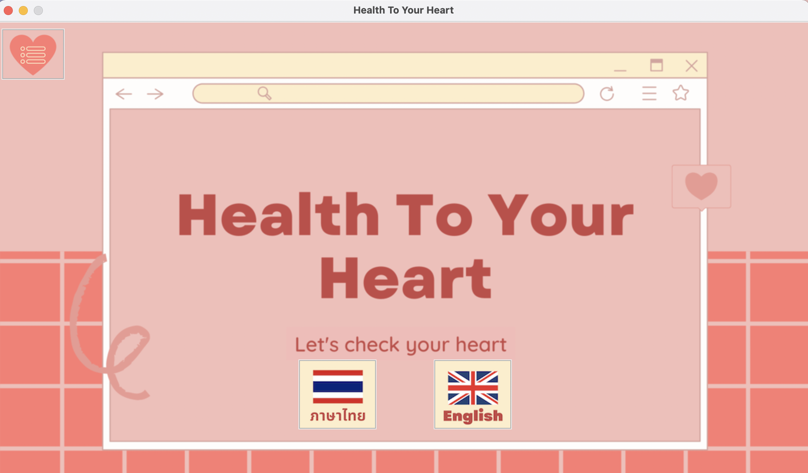
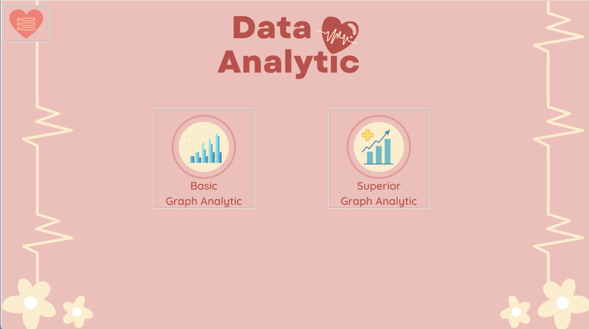
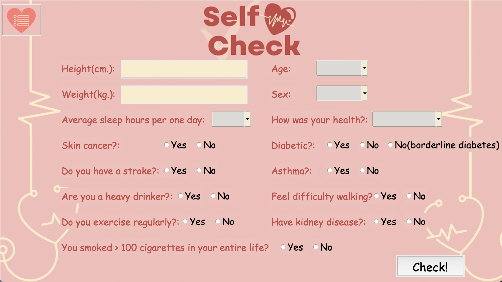
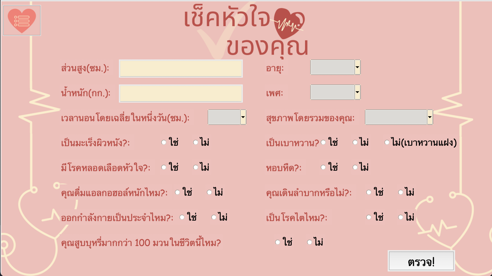
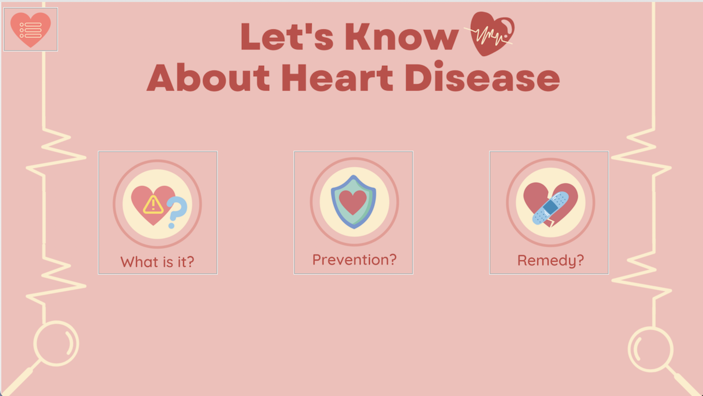
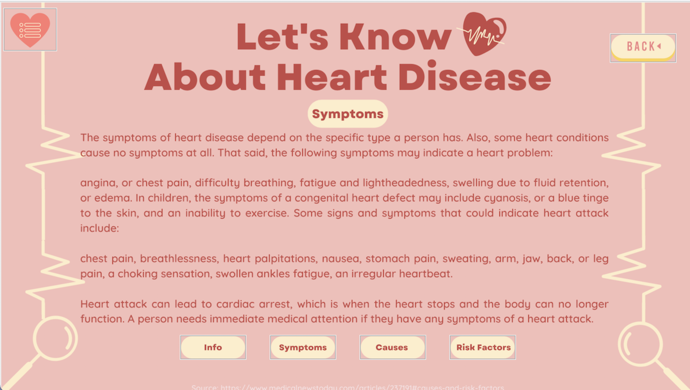
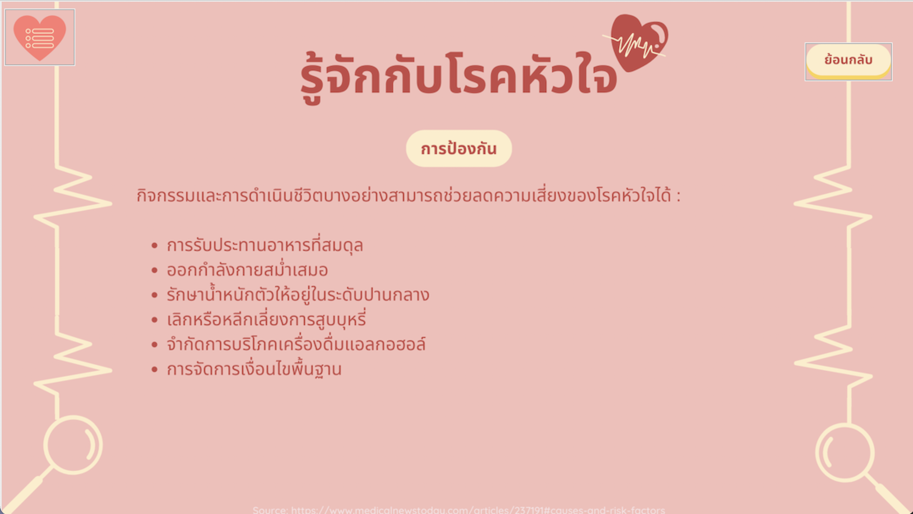
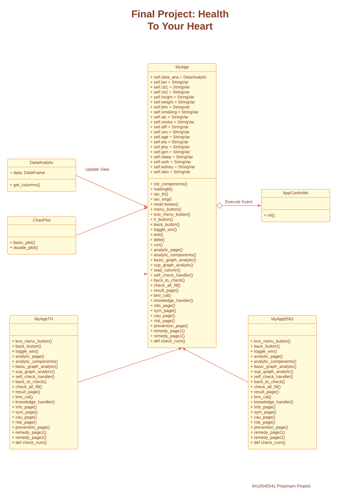

# ♡Health To Your Heart♡
 
## ♡Description
This program mainly focused on heart disease.

This program is a bilingual program that users can choose 
to change the language mode as they want at any time in 
the home page menu. There are 2 languages to choose from which are
Thai and English.

**The second menu is the data analysis menu.📈📊**

If you go to this menu, this program will use the data 
from the web for statistical analysis. Users can view 
this analysis through different types of graphs.

**The third menu is the self-check menu.✅❤️**

This function is for calculating the likelihood 
of future heart disease for the user. 
The calculations are based on data from our 
existing datasets and are based on reasonable 
principles with an accuracy of 85.74%.

**🇹🇭Thai mode:🇹🇭**

**The fourth menu is the Knowledge Center menu.🔍🚫❤️‍🩹**

This function is for educating users about heart 
disease such as basic information, causes and risk 
factors for heart disease, prevention and treatment methods.

**The fifth menu is the hotline menu.**
This menu is intended for those who wish to 
consult a doctor immediately online. For those who choose 
English mode, the hotline will direct you to the international 
hospital website, while the Thai mode will direct you to the Thai 
hospital website.

**Demonstration video: https://youtu.be/JYeLoJtcL6E**
 
## ♡Running the Application
To run this application, you need:
- Tkinter
- Pandas
- Matplotlib
- tkmacosx
- PIL
- playsound
- sklearn
- csv

But for this file you can run it through 'app_controller.py' easily.
 
## ♡Design

Since I use design MVC design pattern and Template Method, it makes the UML 
diagram become like this. The main functions of the program are divided 
into three parts:

**1. Model**

Here my model is **DataAnalytic** class because it serves to store data for use.

**2.View**

In this program the View is the class **MyApp** which has two subclasses, 
**MyAppTH** and **MyAppENG**, which are important in enabling this program to change
the language system. The creation of these two classes takes the form of the template method design pattern to help. 
In conclusion, the View section controls what the user sees on the screen. 
In other words, the entire GUI is controlled by this section.

**3.Controller**

This is the part that controls the overall program execution 
and controls mathematical calculations in the *AppController* class.
 
## ♡Design Patterns Used
**In this project, I've used two main design pattern:**

**1. MVC**

MVC is an abbreviation for Model View Controller, used to refer 
to a structured software development model that breaks down.
into 3 main parts according to the abbreviation of the name

I feel that this model is suitable for my project 
because this work requires both interface and background of the program.

I've set the view to control only the user interface, which is a class named
MyApp

Then, the Model seems to be the 'DataAnalysis' class.

**2. Template Method Design Pattern**

The template method design patter allows coding user interfaces to be more simplify 
and systematically modify parts of classes. 

I have used this method to create the MyApp class as an abstact class.
Then, I make two more subclasses which are MyAppTH and MyAppENG for the languages function.

 
## ♡Other Information 📖
While making this project, I have experienced programming with the tkinter library. 
Normally, I can program with a simple GUI, but now I can add features like 
progress bar to my app. 

Moreover, I have learned more about design patterns both when 
figuring out the right pattern for my work and when implementing the pattern in my work. 
I understand that design the design pattern really has an effect on systematic coding 
and has made coding more convenient for me. 

I have also been practicing my new knowledge 
using **sklearn**, a library of machine learning that is quite useful for computation.

💖**Thank you for your attention**💖

